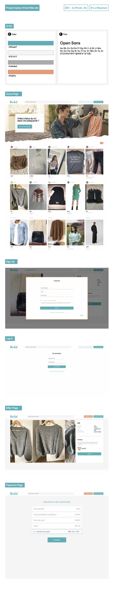

Vinted clone made at [Le Reacteur](https://www.lereacteur.io/)

check backend >> [backend](https://github.com/MirkoChiavaroli/Vinted-Backend)

Stacks [Javascript] [ReactJS] [HTML5] [CSS3]

Running the project

1️ > Install packages

npm install

or

yarn

2 > When installation is complete:

yarn start

